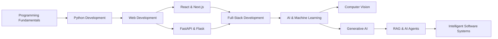

<h1 align="center">Hi 👋, I'm Asish Mohanty</h1>

<h3 align="center">
Software Engineer • Full-Stack Developer • AI/ML Enthusiast
</h3>

<p align="center">
  
</p>

<p align="center">
  <a href="https://github.com/asishmohanty2005">
    
  </a>
  <a href="https://www.linkedin.com/in/asish-mohanty-010181321">
    
  </a>
</p>

---

## 👨‍💻 About Me

```yaml
Name: Asish Mohanty
Role: Software Engineer & AI Developer
Focus:
  - Full-Stack Development
  - Artificial Intelligence
  - Machine Learning
  - Computer Vision
  - Generative AI
  - Intelligent Systems

Currently_Learning:
  - AI Agents
  - RAG Systems
  - LangChain
  - Software Architecture
  - Cloud Deployment

Goal: Build scalable software that solves real-world problems
```

* 🎓 B.Tech Computer Science & Engineering student
* 💻 Building full-stack and AI-powered applications
* 🐍 Python is one of my primary programming languages
* ⚡ Working with React, FastAPI, PostgreSQL, AI/ML and real-time systems
* 🤖 Exploring Generative AI, RAG, LLMs and intelligent automation
* 🚀 Interested in turning ideas into practical software products

---

# 🛠️ Tech Stack

## 💻 Programming Languages

<p align="left">


</p>

---

## 🎨 Frontend Development

<p align="left">


</p>

---

## ⚙️ Backend Development

<p align="left">


</p>

---

## 🧠 AI / Machine Learning

<p align="left">


</p>

```text
Scikit-learn • MediaPipe • LangChain
Generative AI • RAG • LLM APIs
Computer Vision • NLP
```

---

## 🗄️ Databases

<p align="left">


</p>

---

## 🧰 Tools & Platforms

<p align="left">


</p>

---


# 📚 My Development Journey



---

# 🎯 What I Do

```python
class AsishMohanty:

    def __init__(self):

        self.role = "Software Engineer & AI Developer"

        self.languages = [
            "Python",
            "JavaScript",
            "TypeScript",
            "Java",
            "C",
            "C++"
        ]

        self.focus = [
            "Full-Stack Development",
            "Artificial Intelligence",
            "Machine Learning",
            "Computer Vision",
            "Generative AI"
        ]

    def current_mission(self):

        return "Build intelligent software that solves real-world problems."


developer = AsishMohanty()

print(developer.current_mission())
```

---

# 🤝 Connect With Me

<p align="center">

<a href="https://github.com/asishmohanty2005">

</a>

<a href="https://www.linkedin.com/in/asish-mohanty-010181321">

</a>

</p>

---

<h2 align="center">💡 Developer Philosophy</h2>

<p align="center">

<b>Build. Learn. Improve. Repeat.</b>

</p>

<p align="center">

I believe the best way to become a better developer is to build real projects,<br>
solve real problems and keep improving every day.

</p>

---

<p align="center">


</p>

<h3 align="center">

⭐ Thanks for visiting my GitHub profile!

</h3>
